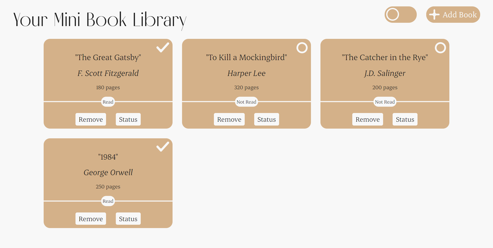
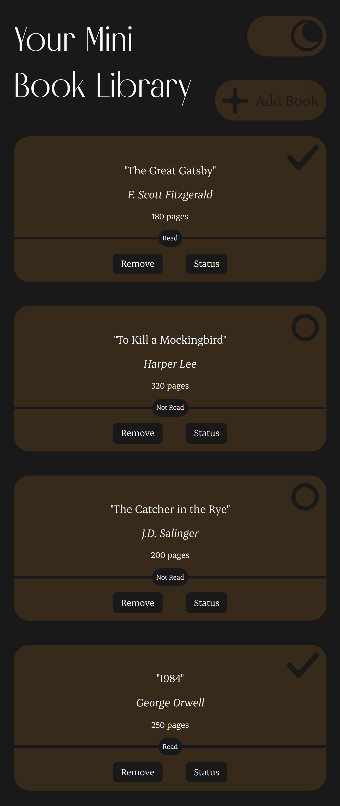

# Mini Book Library
This is a Mini Book Library Page where you can save and organize your favorite books

- You can add different kinds of books with details like author, pages
- You can set and change the read status of the books
- Light/Dark Mode to please your eyes

Enjoy !

## About the Project
This is a project I created to complete **[The Odin Project](https://www.theodinproject.com/lessons/node-path-javascript-library)** assignment.

The page is fully responsive on both mobile and desktop.

This is my own solution. I wrote every line of codes on my own.

## Screenshots
Desktop Light

Mobile Dark

## Links
Live Site Url - [Book Library](https://0xkev21.github.io/book-library/)

## Built with
- HTML
- Vanilla CSS
- Vanilla Javascript
- Figma for UI

I didn't use any framework or library proving I have full understanding of the fundamentals

## What I learned
Things I have learnt from this project
- How to handle DOM and Events with Javascript
- How to use CSS variables to build Design Modes
- How to collect user's inputs and store data in the code variables
- How to link DOM elements with JS arrays and make them function well according to user's changes
- How to use Local Storage Web API to store user's data and preferences

## About Me
I am a student trying to be a self-taught developer.
- My profile - [Github](https://github.com/0xkev21/)

---